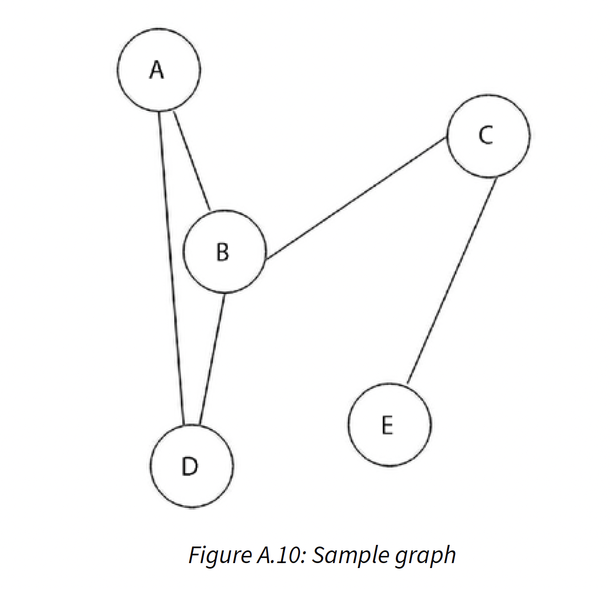

# Exercises

## Question 1

```
What is the maximum number of edges (without self-loops) possible in an undirected
simple graph with five nodes?

Solution
Each node can be connected to every other node in the graph. 
So, the first node can be connected to n - 1 nodes, 
the second node can be connected to n - 2 nodes, 
the third node can be connected to n - 3 nodes, and so on. 
The total number of nodes will be: [(n - 1) + (n - 2) + ... + 3 + 2 + 1] = n(n - 1)/2
```

## Question 2

```
What do we call a graph in which all the nodes have equal degrees?

Solution
A complete graph
```

## Question 3



```
Explain what cut vertices are and identify the cut vertices in the given graph

Solution
Cut vertices also known as articulation points. 
These are the vertices in the graph, after removal of which, 
the graph splits in two disconnected components. 
In the given graph, the vertices B, and C are cut vertices since after removal of node B, 
the graph will split into {A, D}, {C, E} vertices.
And, after removal of node C, the graph will split into {A, B, D}, {E} vertices.
```

## Question 4

```
Assuming a graph G of order n, what will be the maximum number of cut vertices possible
in graph G?

It will be n - 2, since the first and last vertices will not be cut vertices, 
except those two nodes, all nodes can split the graph into two disconnected graphs.
```
