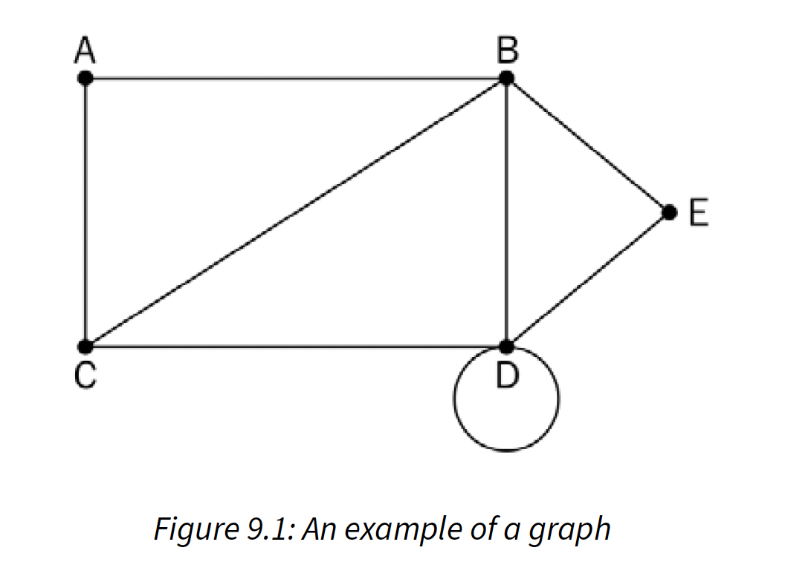
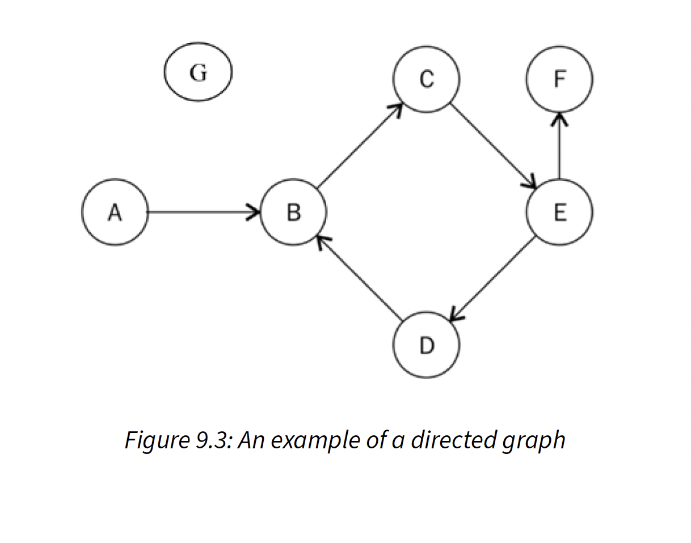
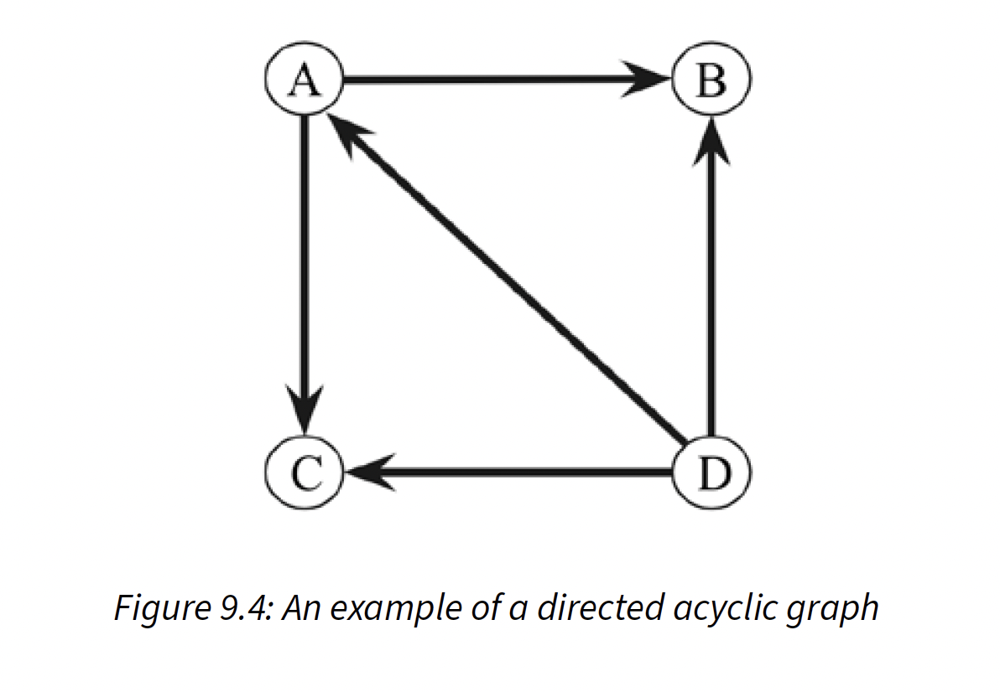
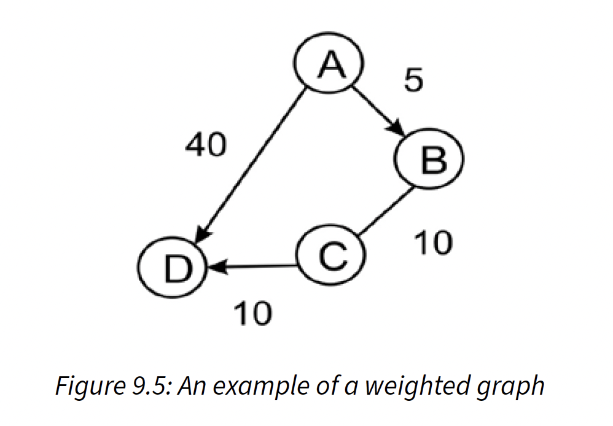
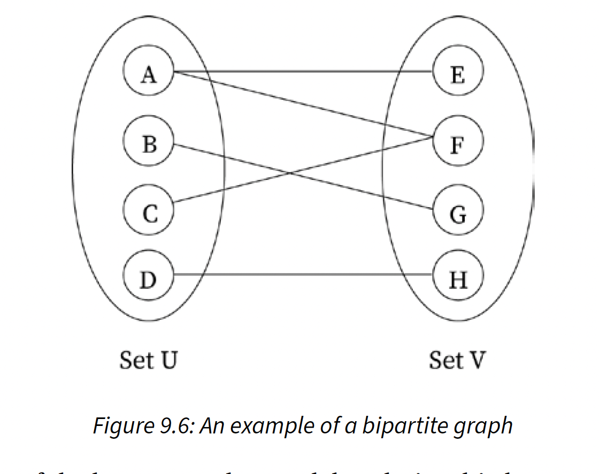

# Graphs & Algorithms

## Graph

- V = {A, B, C, D, E}
- E = {{A, B}, {A, C}, {B, C}, {B, D}, {C, D}, {D, D}, {B, E}, {D, E}}
- G = (V, E)

## Definitions

- **Node or vertex**: A point or node in a graph is called a vertex. In preceding diagram, vertices
  or nodes are **A**, **B**, **C**, **D**, and E and are denoted by a dot.
- **Edge**: This is a connection between two vertices. The line connecting **A** and **B** is an
  example of an edge.
- **Loop**: When an edge from a node is returned to itself, that edge forms a loop, e.g. **D** node.
- **Degree of a vertex/node**: The total number of edges that are incidental on a given vertex is
  called the degree of that vertex. For example, the degree of **B** vertex is 4.
- **Adjacency**: This refers to the connection(s) between any two nodes; thus, if there is a
  connection between any two vertices or nodes, then they are said to be adjacent to each other. For
  example, **C** node is adjacent to **A** node because there is an edge between them.
- **Path**: A sequence of vertices and edges between any two nodes represents a path. For
  example, **CABE** represents a path from **C** node to **E** node.
- **Leaf vertex** (also called pendant vertex): A vertex or node is called a leaf vertex or pendant
  vertex if it has exactly one degree.

## Types of Graphs

- **Directed Graphs**: simply represents edges as lines between the nodes, there is no additional
  information about the relationship between the nodes
- **Undirected Graphs**: the edges provide information on the direction of connection between any
  two nodes in a graph

## Directed Graph Node

- **Indegree**: The total number of edges that come into a vertex in graph is called indegree of
  that vertex. For example, in the diagram, **E** node has 1 indegree, due to edge **CE** coming
  into **E** node.
- **Outdegree**: The total number of edges that go out from a vertex in graph is called outdegree of
  that vertex. For example, **E** node in previous diagram has an outdegree of 2, as it has two
  edges, **EF** and **ED**, going out of that node.
- **Isolated vertex**: A node or vertex is called an isolated vertex when it has a degree of zero,
  as shown as **G** node in diagram.
- **Source vertex**: A vertex is called a source vertex if it has an indegree of zero. For example,
  in diagram, **A** node is the source vertex.
- **Sink vertex**: A vertex is a sink vertex if it has an outdegree of zero. For example, in the
  previous diagram, **F** node is the sink vertex.

## Directed Acyclic Graph (DAG)

- A directed graph with no cycles; in a DAG all edges are directed from one node to another node so
  that sequence of edges never forms a closed loop.
- A cycle in a graph is formed when starting node of first edge is equal to ending node of last edge
  in a sequence.
- So, in a directed acyclic graph, if we start on any path from a given node, we never find a path
  that ends on same node.
- A DAG has many applications, such as in job scheduling, citation graphs, and data compression.

## Weighted Graph

- A graph that has a numeric weight associated with the edges in the graph
- The numeric weight can be used to indicate distance or cost, depending on purpose of graph

## Bipartite Graph

- A special graph in which all nodes of graph can be divided into two sets in such a way that edges
  connect nodes from one set to nodes of another set.
- Bipartite graphs are useful when we need to model a relationship between two different classes of
  objects, for example, a graph of applicants and jobs, in which we may need to model relationship
  between these two different groups; another example may be a bipartite graph of football players
  and clubs in which we may need to model if a player has played for a particular club or not.

## Graph Representation

- Adjacency List: representation is based on a linked list, graph is represented by maintaining a
  list of neighbors (adjacent node) for every vertex (node) of graph
    - preferable for sparse graphs with smaller number of edges
    - i.e. a graph of 200 nodes and 100 edges
    - with an adjacency matrix, size of matrix is 200x200 with a lot of zero values
- Adjacency Matrix: maintain a matrix that represents which node is adjacent to which other node in
  the graph; has information of every edge in graph, which is represented by cells of matrix
    - preferable when we expect graph has a lot of edges, and matrix is dense
    - lookup and check for presence or absence of an edge are very easy compared to adjacency list

## Other Graphs

- Minimum Spanning Tree: subset of edges of connected graph with an edge-weighted graph that
  connects all nodes of graph, with lowest possible total edge weights and no cycle
    - mainly used in network design for road congestion, hydraulic cables, electric cable networks,
      and even cluster analysis
- Kruskal's MST: based on greedy approach
    - Initialize an empty MST (M) with zero edges
    - Sort all edges according to their weights
    - For each edge from sorted list, add them one by one to MST (M) in such a way that it does not
      form a cycle
    - O(E log (E)) or O(E log(V)), where E is number of edges and V is number of vertices
- Prim's MST: also based on greedy approach
    - similar to Dijkstra algorithm for finding the shortest path in a graph
    - Create a dictionary that holds all the edges and their weights
    - Get the edges, one by one, that have the lowest cost from the dictionary and grow the tree in
      such a way that the cycle is not formed
    - Repeat previous step until all vertices are visited
